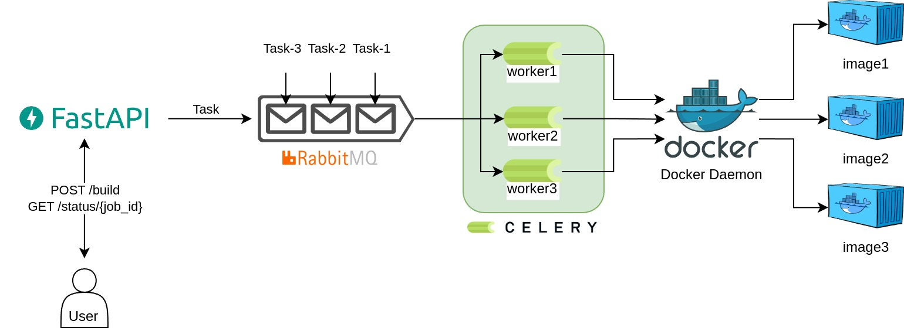

# SAP AICore Dockify

This project provides a FastAPI service with Celery for building and pushing Docker images to a docker registry.


## Contents

- [Architecture](#architecture)
- [Features](#features)
- [Getting Started](#getting-started)
  - [Prerequisites](#prerequisites)
  - [Installation and Running the App](#installation-and-running-the-app)
- [API Endpoints](#api-endpoints)
- [Testing](#testing)
- [Design Choices](#design-choices)
- [Dependencies](#dependencies)

## Architecture

The project consist of three main services:

- **Web (FastAPI App):**  
Exposes the `/build` and `/status/{task_id}` endpoints.

- **Worker (Celery Worker):**  
Processes for building and pushing Docker images.

- **RabbitMQ:**  
Broker between the FastAPI app and the Celery worker.



> **Note:** The Docker daemon is mounted into the Celery worker container to image build/push process.

## Features

- **Build Endpoint:**  
  `POST /build`  
  Accepts a Dockerfile and optional additional files. Initiates an asynchronous Docker image build and push.

- **Status Endpoint:**  
  `GET /status/{task_id}`  
  Checks the status of the Docker image build/push task and returns the resulting image URL if completed.

- **Asynchronous Task Handling:**  
  Uses Celery with RabbitMQ to handle image build processes asynchronously.

- **Containerized Setup:**  
  Uses Docker and Docker Compose to run the entire application stack.


## Getting Started

### Prerequisites

- **Docker & Docker Compose:**  
  Ensure Docker and Docker Compose are installed on your machine.

- **Python 3.9 or later:**  
  For local development and testing (if not using the provided Docker images).

### Installation and Running the App

1. **Clone the repository:**
   ```bash
   git clone https://github.com/colakburak/sap-aicore-dockify.git
   cd sap-aicore-dockify
   ```
2. **(Optiona) Create virtual env and install requirments**
    ```bash
    python3 -m venv venv
    source /venv/bin/activate
    pip install -r app/requirements.txt 
    ```
3. **Start the containers**

    ```bash
    docker compose up --build
    ```

3. **Access the api via:** http://localhost:8000/docs

4. **Access the RabbitMQ Management Console:** http://localhost:15672

        Default credentials: guest / guest


## API Endpoints

### `POST /build`
**Description:** Accepts a Dockerfile and optional supporting files, then triggers a Celery task to build and push a Docker image.

**Parameters:**

    user_name (str): Docker registry username.
    repo (str): Repository name.
    dockerfile (file): The Dockerfile to build the image.
    tag (str, optional): Image tag (default: "latest").
    optional_files (list[file], optional): Any additional files needed for the build.
    password (str, optional): Password / PAT token for Docker registry login.

**Response:**

```json
{
  "task_id": "string",
  "image_reference": "user_name/repo:tag",
  "status": "Sent to processing queue",
  "data": {
    "dockerfile": "UploadedFile",
    "optional_files": { "filename": "file_content" }
  }
}
```

### `GET /status/{task_id}`
**Description:** Retrieves the status of a previously submitted image build task.

**Response (if completed succesfull):**
```json
{
  "status": "success",
  "image_url": "https://hub.docker.com/r/user_name/repo",
  "image_reference": "user_name/repo:tag"
}
```
**Response (if still processing):**
```json
{
  "status": "processing"
}
```

**Response (if completed unsuccesfull):**
```json
{
  "status": "failed",
  "step": "build / push",
  "error": "Error Message"
}
```


## Testing
Unit tests are written using pytest. To run the tests locally:
1. (Optional) Activate your virtual environment.

2.
    ```bash
    pytest app/tests/
    ```

The tests include:
- Unit tests for Docker image build & push functions.
- API endpoint tests that mock external dependencies


## Design Choices

### FastAPI
Chosen for its speed, ease of use, and automatic generation of API docs.

### Celery with RabbitMQ:
Used for asynchronous task handling to offload the time-consuming Docker image build and push operations.

### Docker & Docker Compose:
The entire stack is containerized to ensure consistency between development and production environments.
The Docker daemon is shared with the worker via a volume mount (/var/run/docker.sock).

### Simplicity:
The implementation is kept simple and modular. Core functionalities (image build and push) are separated into helper functions for better testability and maintenance.

## Dependencies

    FastAPI
    Celery
    Docker SDK for Python
    RabbitMQ (via Docker image rabbitmq:3-management)
    Uvicorn
    Pytest

See `app/requirements.txt` for the complete list.

---